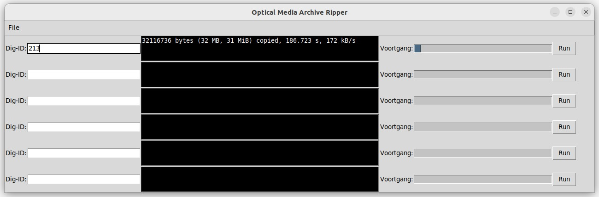

# Optical Media Archive Ripper.
Optical Media Archive Ripper (OMAR) extracts data from CD and DVD media.  
OMAR has not been tested with Blu Ray disks, due to not having a Blu Ray device available.  
OMAR is now capable of extracting data from 12 optical media devices simultaneously.  



OMAR uses the following procedure to extract data from optical media.
- Create a byte-by-byte copy in iso9660 format using the Linux 'dd'-command.
- Creates a checksum of the optical media.
- Creates a checksum of the byte-by-byte copy.
- Compares both previously mentioned checksums, and cancels all operations on failure (checksum mismatch).
- Extracts data from the byte-by-byte copy.

## ToDo:
- (minor) Check if optical media is mounted before unmounting.
- ~~(minor) Blu Ray support.~~  
- (minor usability problem) Propper progress indicator.  
- ~~(minor) Replace some shell commands with python code.~~  
- (major) Error handeling - damaged media.  
- ~~(minor) Log error and create logfile.~~  
- ~~(minor) Output directly to USB disk, requires check if outpath is mounted/a mount point.~~  
- ~~(major) Scale for multiple optical media devices.~~  
- ~~(minor) Add a configuration file.~~  
- ~~(minor) Add an installation script.~~  
- ~~(minor) Validate umount fusemount.~~ 
- (minor) Validate error logging (new)
- (major) Content indexing (new)
- (minor) Empty directory listing (new)

## Installation notes
Requires Ubuntu 20.04 or greater

Install git  
```sudo apt install git```

Clone the repository to your machine  
```git clone https://github.com/STROMANZ/omar.git```

Navigate to the installation directory  
```cd omar/```

Run the install script  
```bash install.sh```

OMAR is now installed. And can be used after relogging or system reboot.
