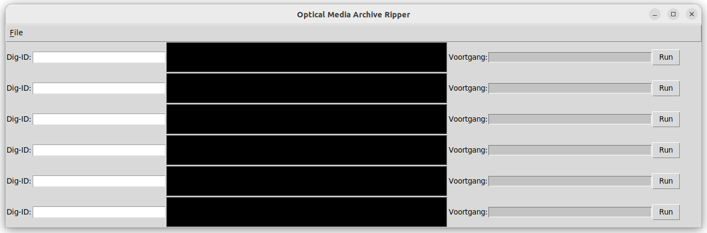

# Optical Media Archive Ripper.
Optical Media Archive Ripper (OMAR) extracts data from CD and DVD media.  
OMAR has not been tested with Blu Ray disks, due to not having a Blu Ray device available.  



OMAR uses the following procedure to extract data from optical media.
- Create a byte-by-byte copy in iso9660 format using the Linux 'dd'-command.
- Creates a checksum of the optical media.
- Creates a checksum of the byte-by-byte copy.
- Compares both previously mentioned checksums, and cancels all operations on failure (checksum mismatch).
- Extracts data from the byte-by-byte copy.

## ToDo:
- (minor) Check if optical media is mounted before unmounting.  
- (minor) Blu Ray support.  
- (minor usability problem) Propper progress indicator.  
- (minor) Replace some shell commands with python code.  
- (major) Error handeling - damaged media.  
- (minor) Log error and create logfile.  
- (minor) Output directly to USB disk, requires check if outpath is mounted/a mount point.  
- (major) Scale for multiple optical media devices.  
- (minor) Add a configuration file.  
- (minor) Add an installation script.  
- (minor) Validate umount fusemount 

## Installation notes  
Copy the desktop file ("shortcut") to the desktop.  
```cp ripper.desktop ~/Desktop/  ```

Adjust the Exec and Icon variables so they match the path to ripper.py and cd.png  
ripper.desktop:  
Modify "Exec" path  
Modify "Icon" path  

Adjust the outpath variable in ripper.py to match the path to the Desktop directory.  
ripper.py:  
Modify "outpath" variable

Trust ripper desktop icon, also set the executable checkbox (right click - properties - Permissions - Allow executing..).  
```gio set ~/Desktop/ripper.desktop metadata::trusted true  ```

Install the fuseiso package as it is required to mount the byte-by-byte copy as a non-privilged user.  
```sudo apt install fuseiso  ```

Install Python TKinter  
```sudo apt install python3-tk```
